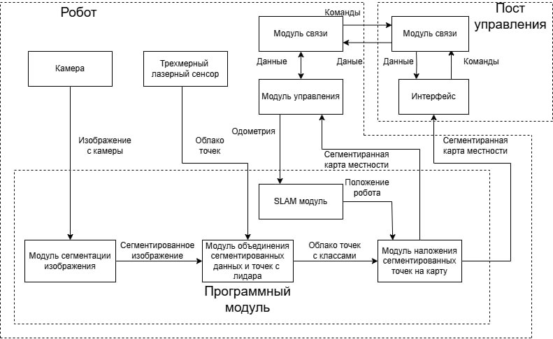

# Дипломное рабочее пространство для работы с картой

# Описание

Данный программный модуль работает следующим образом. 



Данный репозиторий не включает в себя SLAM модуль.

Данное рабочее пространство включаетв в себя пакеты для наложения на карту местности классов поверхностей. Пакет для нахождения классов на изображении работает с помощью onnx модели, работающей на фреймворке openmmlab. Пакет для объединения сегментирванного изображения и данных с лидара на выходе выдает точки в пространстве с классами. Модуль взаимодействия с картой берет карту местнсоти, которую строит SLAM  модуль и проецирует на нее точки, содержащие классы местности. 

# Как запустить

Запуск публикации изображений с камеры:
```bash
ros2 run ximea_cam ximea_frame_publisher
```
Необходимо запустить дублер данных лиадара для данных пакетов:
```bash
ros2 run ximea_cam lidar_duble 
```
Запускаем модуль сихронизации данных с камеры и лидара:
```bash
ros2 run stream_camera_lidar sync_node 
```
Запускаем модуль обработки изображения с помощью модели в onnx формате:
```bash
ros2 run onnx_segmentation test_node
```

